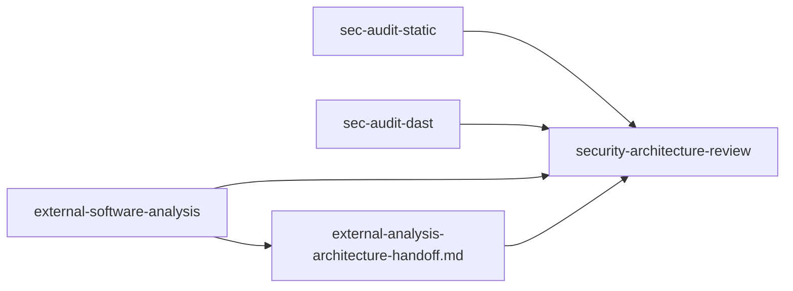

# oh-my-secuaudit

Security skill collection for Codex-style workflows.

## Layout

- `skills/static/sec-audit-static`: static security audit workflow (SAST/SCA/secret/reporting)
- `skills/runtime/sec-audit-dast`: runtime/API assessment workflow (DAST/ASM)
- `skills/external/external-software-analysis`: third-party software/binary analysis workflow
- `skills/architect/security-architecture-review`: security architecture review workflow

## Skill Relationships

## Data Contract Between Skills

- Producer skills:
  - `sec-audit-static`
  - `sec-audit-dast`
  - `external-software-analysis`
- Consumer/synthesis skill:
  - `security-architecture-review`
- Common required finding fields for synthesis:
  - `finding_id` (or `id`)
  - `severity`
  - `provenance` (`binary-confirmed|source-confirmed|runtime-confirmed|not-confirmed`)
  - `impacted_flow` (e.g. `F1`, `F2`)
- Common summary format:
  - `reporting_summary_schema.json` (present in static/runtime/external skills)

## Typical Orchestration

1. Run `sec-audit-static` for source-based findings.
2. Run `sec-audit-dast` for runtime/asset findings.
3. Run `external-software-analysis` for binary/package findings and handoff markdown.
4. Run `security-architecture-review` to synthesize all findings into DFD, attack flow, scenario mapping, and final architecture risk summary.

## Notes

- Each skill directory contains its own `SKILL.md`, references, schemas, and scripts.
- Skills are separated by domain under `skills/static`, `skills/runtime`, `skills/external`, and `skills/architect`.
