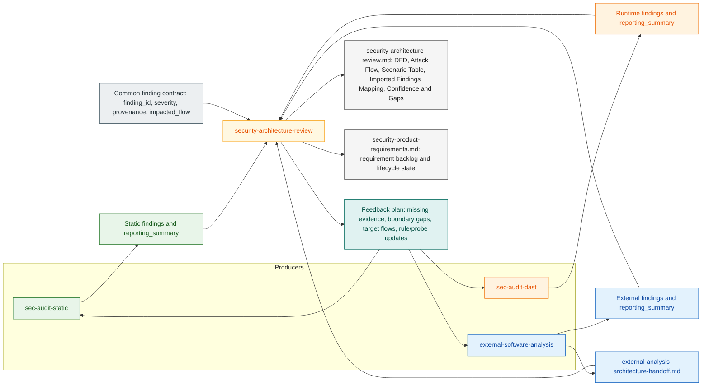

# oh-my-secuaudit

Security skill collection for Codex-style workflows.

## Layout

- `skills/static/sec-audit-static`: static security audit workflow (SAST/SCA/secret/reporting)
- `skills/runtime/sec-audit-dast`: runtime/API assessment workflow (DAST/ASM)
- `skills/external/external-software-analysis`: third-party software/binary analysis workflow
- `skills/architect/security-architecture-review`: security architecture review workflow

## Capability Matrix

| Skill | Primary Question | Typical Input | Primary Output | Consumed By |
|---|---|---|---|---|
| `sec-audit-static` | What is vulnerable in source code and dependencies? | source repo | finding JSON, task/final report JSON, markdown report, `reporting_summary` | `security-architecture-review` |
| `sec-audit-dast` | What is exposed or exploitable at runtime? | domains/IPs/endpoints/ASM exports | SARIF/CSV findings, finding JSON, `reporting_summary` | `security-architecture-review` |
| `external-software-analysis` | What risks exist in third-party binaries/packages? | jar/aar/so/external package | markdown report, finding JSON, architecture handoff markdown, `reporting_summary` | `security-architecture-review` |
| `security-architecture-review` | How do all findings affect trust boundaries and critical flows? | static/dast/external outputs + repo evidence | `security-architecture-review.md` + `security-product-requirements.md` (tracked backlog and lifecycle delta) | final artifact |

## End-to-End Relationship Map

Legend:
- Green: static producer flow
- Orange: runtime producer flow
- Blue: external producer flow
- Yellow: architecture synthesis
- Gray: common contract/artifacts
- Teal: feedback loop to producers

## Handoff Contract (Why It Matters)

- `security-architecture-review` is not another scanner.
- It is the synthesis layer that merges heterogeneous evidence and decides:
  - which risks are architecture-confirmed
  - which are external/runtime-only
  - which remain `not-confirmed`
- Cross-skill normalization relies on these fields:
  - `finding_id` (or `id`)
  - `severity`
  - `provenance` (`binary-confirmed|source-confirmed|runtime-confirmed|not-confirmed`)
  - `impacted_flow` (e.g. `F1`, `F2`)

## Minimal Artifact Set For Architecture Review

| Source Skill | Required For Synthesis | Recommended |
|---|---|---|
| `sec-audit-static` | finding JSON with required fields, `reporting_summary` | markdown report and taint/source-sink notes |
| `sec-audit-dast` | finding JSON or normalized runtime findings with required fields, `reporting_summary` | SARIF and reproducible probe metadata |
| `external-software-analysis` | finding JSON with required fields | `external-analysis-architecture-handoff.md` |

## Architecture-to-Product Bridge

- `security-architecture-review` converts High/Critical risks and unresolved gaps into `SPR-*` requirements.
- Each `SPR-*` must include owner, target milestone, status, and testable acceptance criteria.
- Requirement status is updated on every architecture run with a delta:
  - `added`, `updated`, `closed`, `deferred`, `accepted-risk`

## Which Skills To Run

| Situation | Run |
|---|---|
| Source repository audit | `sec-audit-static` -> `security-architecture-review` |
| External endpoint/runtime assessment | `sec-audit-dast` -> `security-architecture-review` |
| Third-party binary/package risk | `external-software-analysis` -> `security-architecture-review` |
| Full blended assessment | `sec-audit-static` + `sec-audit-dast` + `external-software-analysis` -> `security-architecture-review` |

## Recommended Orchestration

1. Run producer skills (`static`, `runtime`, `external`) in parallel where possible.
2. Normalize findings with the common contract (`finding_id`, `severity`, `provenance`, `impacted_flow`).
3. Run `security-architecture-review` to map findings into DFD nodes, trust boundaries, and attack scenarios.
4. Generate a feedback plan from architecture gaps (missing evidence, unresolved boundaries, uncertain flows).
5. Re-run producers with focused scope from the feedback plan, then re-run architecture review.
6. Upgrade `provenance` only when new direct evidence exists.

## Closed-Loop Model (Producer <-> Architecture)

1. Producers find candidates and initial confirmations.
2. Architecture review synthesizes system-level risk and identifies confirmation gaps.
3. Gaps are translated into targeted producer actions (new rules, new probes, deeper binary/source tracing).
4. Producers return refined evidence.
5. Architecture review updates DFD/Attack Flow and confidence.
6. Repeat until major gaps are closed.

## Quality Gates Before Final Report

1. Every imported finding has `provenance` and `impacted_flow`.
2. External runtime-hop components (e.g. RP relay, mobile SDK) appear explicitly in DFD node/edge/boundary mapping.
3. Attack Flow scenarios map back to scenario IDs and imported finding IDs.
4. `Confidence & Gaps` clearly lists unresolved confirmation items.

## Developer Workflow

- Run local validation: `just check` (or `python3 scripts/validate_skills_repo.py`)
- CI runs the same contract validation on `push`/`pull_request` to `main`.
- Quick working tree check: `just status`

Release process:
- See [`.github/RELEASE_GUIDE.md`](.github/RELEASE_GUIDE.md) for versioning/tagging steps.

## Project Docs

- Release notes: `RELEASE_NOTES.md`
- Future plan: `ROADMAP.md`

## Notes

- Each skill directory contains its own `SKILL.md`, references, schemas, and scripts.
- Skills are separated by domain under `skills/static`, `skills/runtime`, `skills/external`, and `skills/architect`.
