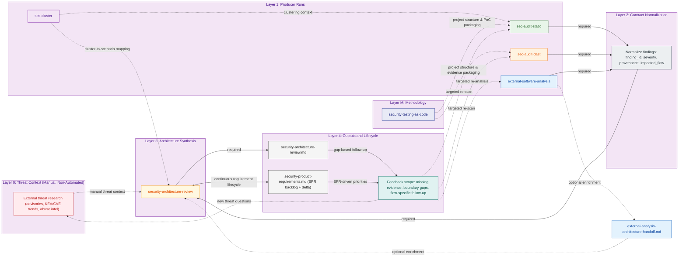

# oh-my-secuaudit

Security skill collection for Claude Code and Codex workflows.

## Install (Claude Code)

This repo is packaged as a Claude Code plugin marketplace named `windshock`. The plugin name is `oh-my-secuaudit`.

```
/plugin marketplace add windshock/oh-my-secuaudit
/plugin install oh-my-secuaudit@windshock
```

To develop locally against this checkout:

```
/plugin marketplace add /Users/<you>/path/to/oh-my-secuaudit
/plugin install oh-my-secuaudit@windshock
```

After install, the six SKILL.md files become discoverable to Claude Code by their frontmatter `description` and trigger automatically when relevant work appears.

## Layout

Skills live under `plugins/oh-my-secuaudit/skills/` (Claude Code plugin convention: `<plugin-root>/skills/<skill-name>/SKILL.md`). Category groupings (architect / runtime / static / external / methodology) live in this README, not in directory paths.

- `plugins/oh-my-secuaudit/skills/sec-audit-static` *(static)*: SAST/SCA/secret/reporting workflow
- `plugins/oh-my-secuaudit/skills/sec-cluster` *(static)*: security code clustering workflow (v4 dataflow-based)
- `plugins/oh-my-secuaudit/skills/sec-audit-dast` *(runtime)*: runtime/API assessment workflow (DAST/ASM)
- `plugins/oh-my-secuaudit/skills/external-software-analysis` *(external)*: third-party software/binary analysis workflow
- `plugins/oh-my-secuaudit/skills/security-architecture-review` *(architect)*: security architecture review workflow
- `plugins/oh-my-secuaudit/skills/security-testing-as-code` *(methodology)*: assessment-as-project workflow (PoC, evidence, handoff)

## Capability Matrix

| Skill | Primary Question | Typical Input | Primary Output | Consumed By |
|---|---|---|---|---|
| `sec-audit-static` | What is vulnerable in source code and dependencies? | source repo | finding JSON, task/final report JSON, markdown report, `reporting_summary` | `security-architecture-review` |
| `sec-cluster` | Which code paths share the same security review strategy? | source repo + static findings | CLUSTERS.md, semgrep rules, REVIEW_CHECKLIST.md | `sec-audit-static`, `security-architecture-review` |
| `sec-audit-dast` | What is exposed or exploitable at runtime? | domains/IPs/endpoints/ASM exports | SARIF/CSV findings, finding JSON, `reporting_summary` | `security-architecture-review` |
| `external-software-analysis` | What risks exist in third-party binaries/packages? | jar/aar/so/external package | markdown report, finding JSON, architecture handoff markdown, `reporting_summary` | `security-architecture-review` |
| `security-architecture-review` | How do all findings affect trust boundaries and critical flows? | static/dast/external outputs + repo evidence | `security-architecture-review.md` + `security-product-requirements.md` (tracked backlog and lifecycle delta) | final artifact |
| `security-testing-as-code` | How to make assessment results reproducible and inheritable? | assessment findings + PoC code | project structure (artifacts/poc/, artifacts/runtime/, handoff-plan.md) | any producer skill |

## End-to-End Relationship Map


```mermaid
flowchart LR
    subgraph L0["Layer 0: Threat Context (Manual, Non-Automated)"]
        T["External threat research (advisories, KEV/CVE trends, abuse intel)"]
    end

    subgraph L1["Layer 1: Producer Runs"]
        S["sec-audit-static"]
        CL["sec-cluster"]
        D["sec-audit-dast"]
        E["external-software-analysis"]
    end

    subgraph LM["Layer M: Methodology"]
        STAC["security-testing-as-code"]
    end

    subgraph L2["Layer 2: Contract Normalization"]
        N["Normalize findings: finding_id, severity, provenance, impacted_flow"]
    end

    subgraph L3["Layer 3: Architecture Synthesis"]
        R["security-architecture-review"]
    end

    subgraph L4["Layer 4: Outputs and Lifecycle"]
        O["security-architecture-review.md"]
        P["security-product-requirements.md (SPR backlog + delta)"]
        FB["Feedback scope: missing evidence, boundary gaps, flow-specific follow-up"]
    end

    S -->|required| N
    CL -.->|clustering context| S
    CL -.->|cluster-to-scenario mapping| R
    D -->|required| N
    E -->|required| N
    E -.->|optional enrichment| EH["external-analysis-architecture-handoff.md"]
    T -.->|manual threat context| R
    STAC -.->|project structure & PoC packaging| S
    STAC -.->|project structure & evidence packaging| D

    N -->|required| R
    EH -.->|optional enrichment| R

    R -->|required| O
    R <--> |continuous requirement lifecycle| P

    O -->|gap-based follow-up| FB
    P -->|SPR-driven priorities| FB

    FB -.->|targeted re-scan| S
    FB -.->|targeted re-scan| D
    FB -.->|targeted re-analysis| E
    FB -.->|new threat questions| T

    classDef static fill:#e8f5e9,stroke:#2e7d32,color:#1b5e20;
    classDef runtime fill:#fff3e0,stroke:#ef6c00,color:#e65100;
    classDef external fill:#e3f2fd,stroke:#1565c0,color:#0d47a1;
    classDef threat fill:#ffebee,stroke:#c62828,color:#b71c1c;
    classDef review fill:#fff8e1,stroke:#f9a825,color:#e65100;
    classDef contract fill:#eceff1,stroke:#455a64,color:#263238;
    classDef artifact fill:#f5f5f5,stroke:#616161,color:#212121;
    classDef feedback fill:#e0f2f1,stroke:#00695c,color:#004d40;

    classDef cluster fill:#f3e5f5,stroke:#7b1fa2,color:#4a148c;
    classDef methodology fill:#e8eaf6,stroke:#283593,color:#1a237e;

    class T threat;
    class S static;
    class CL cluster;
    class D runtime;
    class E,EH external;
    class N contract;
    class R review;
    class O,P artifact;
    class FB feedback;
    class STAC methodology;
```

Legend:
- Green: static producer flow
- Purple: clustering (code pattern grouping)
- Orange: runtime producer flow
- Blue: external producer flow
- Red: external threat context (manual/non-automated input)
- Indigo: methodology (assessment-as-code)
- Yellow: architecture synthesis
- Gray: contract normalization and artifacts
- Teal: feedback loop to producers
- Solid arrow: required handoff
- Dashed arrow: optional enrichment or iterative feedback
- Double arrow: continuous lifecycle synchronization

## Handoff Contract (Why It Matters)

- `security-architecture-review` is not another scanner.
- It is the synthesis layer that merges heterogeneous evidence and decides:
  - which risks are architecture-confirmed
  - which are external/runtime-only
  - which remain `not-confirmed`
- Cross-skill normalization relies on these fields:
  - `finding_id` (or `id`)
  - `severity`
  - `provenance` (`binary-confirmed|source-confirmed|runtime-confirmed|not-confirmed`)
  - `impacted_flow` (e.g. `F1`, `F2`)

## Minimal Artifact Set For Architecture Review

| Source Skill | Required For Synthesis | Recommended |
|---|---|---|
| `sec-audit-static` | finding JSON with required fields, `reporting_summary` | markdown report and taint/source-sink notes |
| `sec-audit-dast` | finding JSON or normalized runtime findings with required fields, `reporting_summary` | SARIF and reproducible probe metadata |
| `external-software-analysis` | finding JSON with required fields | `external-analysis-architecture-handoff.md` |
| external threat research (manual) | not required for run completion | threat themes from advisories/intel mapped to attack scenarios |

## Architecture-to-Product Bridge

- `security-architecture-review` converts High/Critical risks and unresolved gaps into `SPR-*` requirements.
- Each `SPR-*` must include owner, target milestone, status, and testable acceptance criteria.
- Requirement status is updated on every architecture run with a delta:
  - `added`, `updated`, `closed`, `deferred`, `accepted-risk`

## Which Skills To Run

| Situation | Run |
|---|---|
| Source repository audit | `sec-audit-static` -> `security-architecture-review` |
| External endpoint/runtime assessment | `sec-audit-dast` -> `security-architecture-review` |
| Third-party binary/package risk | `external-software-analysis` -> `security-architecture-review` |
| Full blended assessment | `sec-audit-static` + `sec-audit-dast` + `external-software-analysis` -> `security-architecture-review` |

## Recommended Orchestration

1. Run producer skills (`static`, `runtime`, `external`) in parallel where possible.
2. Normalize findings with the common contract (`finding_id`, `severity`, `provenance`, `impacted_flow`).
3. Add manual external threat research themes and map them to candidate attack scenarios.
4. Run `security-architecture-review` to map findings into DFD nodes, trust boundaries, and attack scenarios.
5. Generate a feedback plan from architecture gaps (missing evidence, unresolved boundaries, uncertain flows, new threat questions).
6. Re-run producers with focused scope from the feedback plan, then re-run architecture review.
7. Upgrade `provenance` only when new direct evidence exists.

## Closed-Loop Model (Producer <-> Architecture)

1. Producers find candidates and initial confirmations.
2. Architecture review synthesizes system-level risk and identifies confirmation gaps.
3. Gaps are translated into targeted producer actions (new rules, new probes, deeper binary/source tracing).
4. Producers return refined evidence.
5. Architecture review updates DFD/Attack Flow and confidence.
6. Repeat until major gaps are closed.

## Quality Gates Before Final Report

1. Every imported finding has `provenance` and `impacted_flow`.
2. External runtime-hop components (e.g. RP relay, mobile SDK) appear explicitly in DFD node/edge/boundary mapping.
3. Attack Flow scenarios map back to scenario IDs and imported finding IDs.
4. `Confidence & Gaps` clearly lists unresolved confirmation items.

## Developer Workflow

- Run local validation: `just check` (or `python3 scripts/validate_skills_repo.py`)
- CI runs the same contract validation on `push`/`pull_request` to `main`.
- Quick working tree check: `just status`

Release process:
- See [`.github/RELEASE_GUIDE.md`](.github/RELEASE_GUIDE.md) for versioning/tagging steps.

## Project Docs

- Release notes: `RELEASE_NOTES.md`
- Future plan: `ROADMAP.md`

## Setup

### Claude Code

Preferred path — install as a plugin (see [Install](#install-claude-code) above). After install, skills auto-trigger from their frontmatter descriptions; no per-skill setup needed.

Alternative paths (without the plugin):

1. **Direct reference**: Ask Claude Code to read and follow a specific `SKILL.md`:
   ```
   Read plugins/oh-my-secuaudit/skills/sec-audit-static/SKILL.md and run the static audit playbook for this codebase.
   ```

2. **Project commands**: Symlink skill directories into your project's `.claude/commands/`:
   ```bash
   mkdir -p .claude/commands
   ln -s "$(pwd)/plugins/oh-my-secuaudit/skills/sec-audit-static/SKILL.md" .claude/commands/sec-audit-static.md
   ```

3. **CLAUDE.md integration**: Reference skills from your project's `CLAUDE.md`:
   ```markdown
   For security audits, follow the workflow in /path/to/oh-my-secuaudit/plugins/oh-my-secuaudit/skills/sec-audit-static/SKILL.md
   ```

### Codex

Each skill directory includes `agents/openai.yaml` for Codex-native discovery. Copy or symlink skill directories into `~/.codex/skills/local/`.

## Related Reading

Blog posts from [Code Before Breach](https://windshock.github.io/en/):

| Skill | Post | Relevance |
|---|---|---|
| `security-testing-as-code` | [Security Diagnostics Reports Die Upon Publication](https://windshock.github.io/en/post/2026-03-17-security-testing-as-code/) | Direct source — assessment-as-project thesis |
| `sec-cluster` | [Structure Builders Will Outlast Vulnerability Finders](https://windshock.github.io/en/post/2026-04-02-security-from-sense-to-structure/) | Systematic structure over ad-hoc finding |

## Notes

- Each skill directory contains its own `SKILL.md`, references, schemas, and scripts.
- Skills are flat under `plugins/oh-my-secuaudit/skills/`; the architect / runtime / static / external / methodology grouping is documented in the [Layout](#layout) section above.
